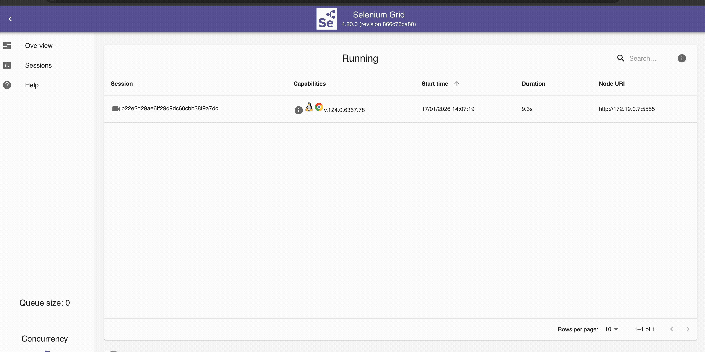
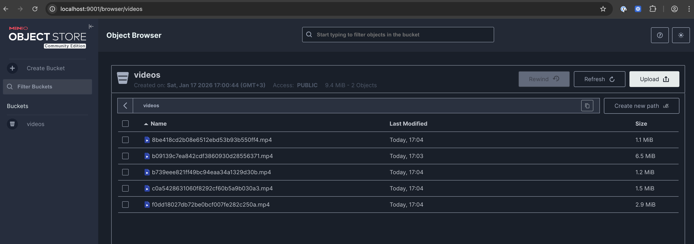
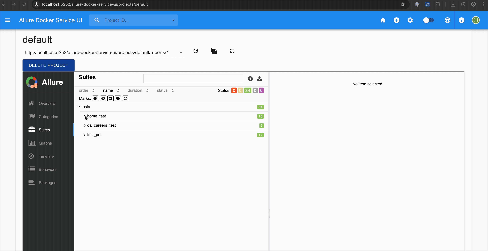

# 🎯 QA Automation Case Study 🚀

A comprehensive QA automation solution covering **UI Testing**, **API Testing**, and **Load Testing** with Docker-based infrastructure including Selenium Grid, video recording, and Allure reporting.

## 📜 Solution Details

This project demonstrates a complete test automation framework with three main test suites:

1. **UI Test Automation** - Selenium-based tests with Page Object Model design pattern
2. **API Test Automation** - Pytest-based API tests for Petstore Swagger endpoints with Pydantic validation
3. **Load Testing** - Locust-based performance tests for n11.com search module

The infrastructure is fully containerized with Docker Compose, featuring Selenium Grid for parallel browser execution, MinIO for video storage, and Allure for comprehensive test reporting.

## 🏗️ Project Structure

```
├── ui-test/              # Selenium-based UI test automation
├── api-test/             # API test automation for Petstore
├── load-test/            # Locust-based load testing for n11.com
├── images/               # Documentation images and GIFs
├── docker-compose.yml    # Docker infrastructure
├── run-tests.sh          # Test runner script
└── README.md
```

## 🚀 Quick Start (Docker)

The easiest way to run all tests is using Docker Compose:

```bash
# Start infrastructure (Selenium Grid, MinIO, Allure)
./run-tests.sh --start-infra

# Run all tests
./run-tests.sh --all

# Run UI tests only with Chrome
./run-tests.sh --ui --browser chrome

# Run UI tests only with Firefox
./run-tests.sh --ui --browser firefox

# Run API tests only
./run-tests.sh --api

# Stop all containers
./run-tests.sh --stop
```

### 📊 Access Points

| Service | URL | Credentials |
|---------|-----|-------------|
| Allure Report | http://localhost:5252 | - |
| Selenium Grid | http://localhost:4444 | - |
| Chrome noVNC | http://localhost:7900 | - |
| Firefox noVNC | http://localhost:7901 | - |
| MinIO Console | http://localhost:9001 | minio / minio123 |
| Test Videos | http://localhost:9000/videos | - |

---

## 🚀 Key Features

### 🕸️ Selenium Grid

Tests run on Selenium Grid with support for both Chrome and Firefox browsers. You can watch tests in real-time via noVNC:



### 🎥 Video Recording

Test sessions are recorded by `selenium/video:ffmpeg` and uploaded to MinIO (Amazon S3 compatible storage) via RCLONE. Videos are automatically attached to Allure reports.



### 📈 Allure Reporting

Comprehensive test reports with screenshots, video recordings, and detailed test steps are available via Allure Docker Service:



---

## 🧪 Test Modules

### 1. UI Test Automation (`ui-test/`)


**Test Scenarios:**
- ✅ Verify home page loads with all main blocks (header, navigation, sections, footer)
- ✅ Navigate to QA Careers page and filter jobs by Istanbul, Turkey
- ✅ Validate job listings contain "Quality Assurance" in position/department
- ✅ Verify "View Role" redirects to Lever application page

**Features:**
- Page Object Model (POM) design pattern
- Cross-browser support (Chrome & Firefox) - parametrically configurable
- Automatic screenshot capture on test failure
- Video recording via Selenium Grid
- Allure reporting with screenshots and video links

📖 See [ui-test/README.md](./ui-test/README.md) for detailed documentation.

---

### 2. API Test Automation (`api-test/`)

Pytest-based API test automation for [Petstore Swagger](https://petstore.swagger.io/) pet endpoints.

**Test Coverage:**
- `GET /pet/{petId}` - Retrieve pet by ID
- `POST /pet` - Create new pet
- `PUT /pet` - Update existing pet
- `POST /pet/{petId}` - Update pet with form data
- `DELETE /pet/{petId}` - Delete pet

**Features:**
- Pydantic models for request/response validation
- Service layer pattern for clean API abstraction
- Allure reporting support
- Comprehensive test cases including edge cases

📖 See [api-test/README.md](./api-test/README.md) for detailed documentation.

---

### 3. Load Testing (`load-test/`)

Locust-based load testing for [n11.com](https://www.n11.com/) search module.

**Test Scenarios:**
| Scenario | Weight | Description |
|----------|--------|-------------|
| Basic Search | 5 | Search with terms from CSV, validate results |
| Pagination | 2 | Search and navigate to page 2 |
| Invalid Search | 1 | Edge cases with invalid search terms |

📖 See [load-test/README.md](./load-test/README.md) for detailed documentation.

---

## ⚙️ Setup Instructions

### 1️⃣ Clone the Repository

```bash
git clone https://github.com/yourusername/alperen_yilmaz_case
cd alperen_yilmaz_case
```

### 2️⃣ Set Up the Video Recording Directory

```bash
mkdir -p /tmp/test-recordings
chmod 777 /tmp/test-recordings
```

### 3️⃣ Run the Tests Using Docker Compose

```bash
# Start all infrastructure and run UI tests with Chrome
./run-tests.sh --ui --browser chrome

# Or run all tests
./run-tests.sh --all
```

This command will:
- Start a Selenium Grid hub with Chrome and Firefox nodes
- Enable video recording for test execution
- Configure MinIO to store and serve video recordings
- Execute the tests
- Generate Allure reports

---

## 🏃‍♂️ Running Tests Locally

### UI Tests

```bash
cd ui-test
python -m venv venv
source venv/bin/activate
pip install -r requirements.txt

# Run with default browser
pytest

# Run with specific browser
UI_TEST_DRIVER_TYPE=firefox pytest

# Run with Selenium Grid
SELENIUM_GRID_URL=http://localhost:4444/wd/hub pytest
```

### API Tests

```bash
cd api-test
python -m venv venv
source venv/bin/activate
pip install -r requirements.txt

# Run tests
pytest

# Run with Allure report
pytest --alluredir=allure-results
```

### Load Tests

```bash
cd load-test
python -m venv venv
source venv/bin/activate
pip install -r requirements.txt

# Web UI mode
locust -f locustfile.py

# Headless mode
locust -f locustfile.py --headless -u 1 -r 1 -t 1m
```

---

## 🔧 Configuration

### UI Test Configuration

Edit `ui-test/pyproject.toml` or use environment variables:

```toml
[tool.ui-test-config]
driver_type = "chrome"          # or "firefox"
base_url = "https://insiderone.com/"
headless = false
screenshot_on_failure = true
```

Environment variables (override config file):
```bash
export UI_TEST_DRIVER_TYPE=firefox
export UI_TEST_HEADLESS=true
export SELENIUM_GRID_URL=http://localhost:4444/wd/hub
```

### API Test Configuration

Edit `api-test/config.py`:
```python
BASE_URL = "https://petstore.swagger.io/v2"
TIMEOUT = 30
```

### Load Test Configuration

Edit `load-test/config.py`:
```python
BASE_URL = "https://www.n11.com"
MIN_WAIT_TIME = 1
MAX_WAIT_TIME = 3
```

---

## 📋 Requirements

- Docker & Docker Compose
- Python 3.10+ (for local execution)
- Chrome and/or Firefox (for local UI tests)

